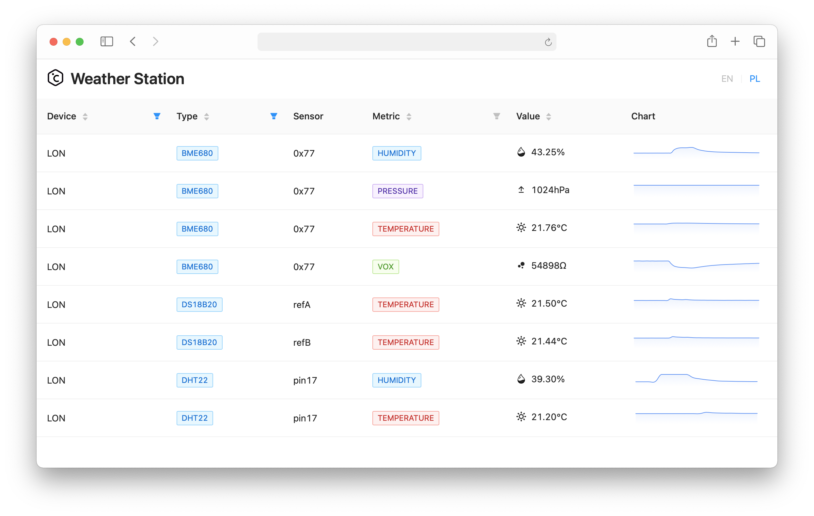

# Weather Station based on Raspberry Pi and AWS

The project objectives were to create a way to remotely monitor countryside house temperature with Raspberry Pi and
sensors like DS18B20, and to automate the control of emergency heating with relays and GPIOs, to protect water pipes in
the winter. The POC was ready in under two weeks, however later on I decided to push the project further and use it as a
sandbox to broaden my skill set.

### Repositories

- [[GitHub] bartoszadamczyk/weather-station-cloud](https://github.com/bartoszadamczyk/weather-station-cloud)
    - [/app](https://github.com/bartoszadamczyk/weather-station-cloud/app) - frontend React App that displays live
      readings. Tech stack: `Netlify`, `TypeScript`, `React`, `Immer`, `WebSockets`, `i18next`, `antd`, `Sentry`, 
      `Jest`, `ESLint`, `GitHub Actions`
    - [/serverless](https://github.com/bartoszadamczyk/weather-station-cloud/serverless) - serverless API bundled with
      Serverless and hosted on AWS Lambda. Tech stack: `Serverless`, `TypeScript`, `DynamoDB`, `SQS`,
      `AWS API Gateway (with WebSockets)`, `AJV`, `Sentry`, `Mocha`, `Chai`, `Sinon`, `ESLint`, `GitHub Actions`
    - [/terraform](https://github.com/bartoszadamczyk/weather-station-cloud/terraform) - Tech stack: `Terraform`, 
      `TFLint`, `GitHub Actions`
- [[GitHub] bartoszadamczyk/weather-station-rpi](https://github.com/bartoszadamczyk/weather-station-rpi) - raspberry Pi worker
  deployed with balena.io. Tech stack: `Raspberry Pi`, `Linux`, `balena.io`, `Docker`, `Python`, `AsyncIO`, `SQS`, 
  `Mypy`, `Black`, `Flake8`, `Sentry` and `GitHub Actions`

## Naming conventions

### AWS resources

For all AWS resources this project follows naming convention:

- `S3: namespace-app-env-region-[name]`
- `IAM: {account}/app-env-region-[name]`
- `DynamoDB: {account}/{region}/app-env-[name]`

This provides:

- no conflicts with other `accounts`, `regions`, `environments`,
- it is easy to read for humans,
- for a `name`, `region` and `env` we can use wildcard for example in the `IAM` policies.

### Variables and data naming convention

- Variables in API, and data pipelines should use `snake_case`
- SQL DBs should use `snake_case`
- DynamoDB should use `camelCase`
- Constant values in:
    - Python: `const FOO = "foo"`
    - TypeScript: `const Foo = "foo"`
- Time should be stored as timestamp with milliseconds without coma

## Serverless vs Terraform

Following [serverless advice](https://www.serverless.com/blog/definitive-guide-terraform-serverless), this project is
using both. Serverless is used to easily deploy lambda code together with app-specific infrastructure. On the other hand
terraform is used to set up shared and persistent parts of infrastructure like data tables that should not be affected
by a serverless teardown or updates.

> ### Managing shared vs. app-specific infrastructure
> While we believe that all infrastructure should be managed with IaC automation, we like to distinguish between the
> infrastructure that’s specific to one application and the infrastructure that’s shared between multiple applications
> in your stack. Those might need to be managed in different ways.
>
> Application-specific infrastructure gets created and torn down as the app gets deployed. You rarely change a piece of
> application-specific infrastructure; you’ll just tear everything down and re-create it from scratch. As the app is
> developed, the infrastructure that supports it also needs to change, sometimes significantly from one deploy to another.
>
> The shared infrastructure, on the other end, rarely gets re-created from scratch and is more stateful. The core set of
> infrastructure (such as the set of security groups and your VPC ID), won’t change between the deploys of your
> application, as they’re probably referenced by many applications in your stack. Those more persistent pieces of
> infrastructure will generally be managed outside of your deploy pipeline.
[[Source](https://www.serverless.com/blog/definitive-guide-terraform-serverless)]

## Deployment

### Warning!!! Depending on the number of devices and sensors AWS cost can exceed your free tier!!!

1. Fork and clone this repo
2. You need:
    - AWS account
    - AWS CLI installed and configured on your computer
    - Terraform installed (`brew install terraform`)
    - Node.js installed (`brew install n`)
    - Netlify account
    - [Optional] Terraform account
    - [Optional] Sentry account (one sentry_dsn per app)

### Terraform

1. Enter terraform folder (`cd terraform`)
1. Edit `backend`, `region` and `locals` in `main.tf`
2. You can use terraform backend or store the state locally
3. Run `terraform apply` to deploy your infrastructure
4. Create AWS user for your Raspberry Pi and assign `rpi` group created with Terraform.

### Serverless App

1. Enter serverless folder (`cd serverless`)
2. Edit `service` and `deploymentBucket` - this property optional
3. [Optional] You can store sentry DSN in AWS parameter store as `weather-station-serverless-sentry-dsn`
4. Run `yarn`
5. To deploy, run `yarn run deploy`
6. Note `websocket url`

### Frontend App

1. Login to `Netlify`
2. Create new app with the code from your repo with:
    - Build settings:
        - Base directory: `app`
        - Build command: `yarn build`
        - Publish directory: `app/build`
    - Environment variables:
        - REACT_APP_WEBSOCKET_URL: url from the serverless log
        - [Optional] REACT_APP_SENTRY_DSN: your_sentry_dsn

## Backlog

- [x] End to end MVP
- [ ] More frontend tests
- [ ] Move types and ajv validators to separate repo and pre compile. For they are symlinked between `serverless`
  and `app`
- [ ] Send live data only when there is active client (requires websocket in RPi app)
- [ ] More charts and compare
- [ ] Historic data (aggregated)
- [ ] Authentication
- [ ] Implement alarms
- [ ] Relays remote control

